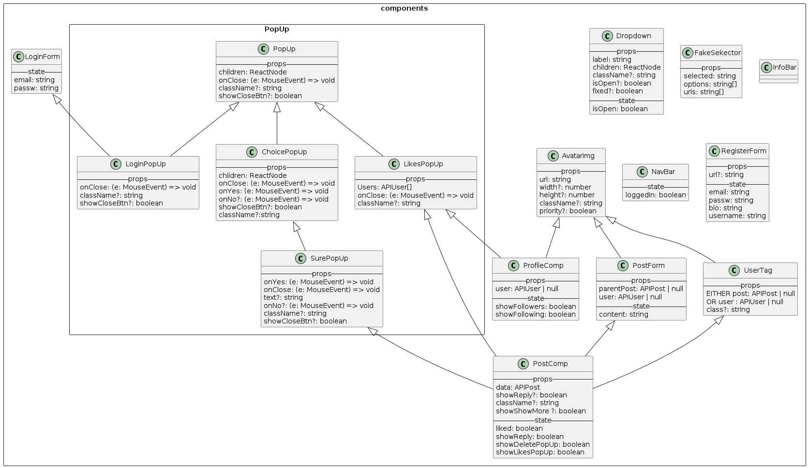

# Coté client (React)

Un des avantages de Next13+ et le dossier `app` est le fait qu'il s'occupe pour nous du routing de l'application de part la structure du dossier. Par exemple le fichier `app/login/page.tsx` est la page atteignable à l'adresse `/login`. Pour plus d'information, voir [la documentation de Next.js](https://beta.nextjs.org/docs/routing/fundamentals#the-app-directory)

## Structure du dossier `app`

Dans le dossier `app`, tout les dossiers serv à déterminer le chemin de la page. Excepté le dossier `components` qui contient les composants réutilisables.

### `components`

Les components utilisés dans la pages sont :
(leurs props seront détaillés si nécessaire, pour une liste complète voir l'image ci-dessous)

- `AvatarImg` : Le composant de l'avatar de l'utilisateur. Il prend en paramètre l'url de l'image et la taille. Il est possible de passer une classe css pour le modifier.

- `Dropdown` : Liste déroulante, affiche/cache les enfants quand on clique dessus.

- `FakeSelector` : Composant qui donne l'impression d'un choix fluide mais est en réalité que des liens. (Solution temporaire)

- `InfoBar`: Barre d'information affiché à droite sur la version desktop.

- `LoginForm`: Formulaire de connexion.

- `NavBar`: Barre de navigation. Affiché à gauche sur la version desktop.
