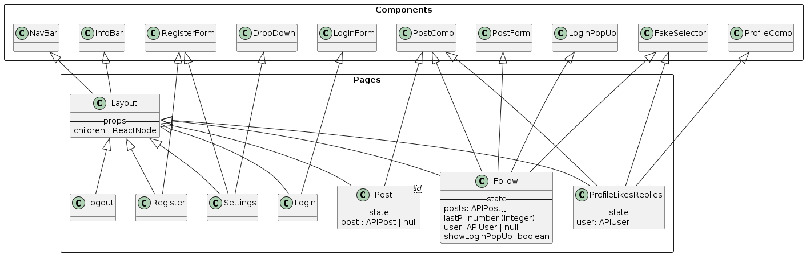

# Coté client dans `app` (React)

Un des avantages de Next13+ et le dossier `app` est le fait qu'il s'occupe pour nous du routing de l'application de part la structure du dossier. Par exemple le fichier `app/login/page.tsx` est la page atteignable à l'adresse `/login`. Pour plus d'information, voir [la documentation de Next.js](https://beta.nextjs.org/docs/routing/fundamentals#the-app-directory)

## Structure du dossier `app`

Dans le dossier `app`, tout les dossiers serv à déterminer le chemin de la page. Excepté le dossier `components` qui contient les composants réutilisables.

### `components`

Les components utilisés dans la pages sont :
(leurs props seront détaillés si nécessaire, pour une liste complète voir l'image ci-dessous)

- `AvatarImg` : Le composant de l'avatar de l'utilisateur. Il prend en paramètre l'url de l'image et la taille. Il est possible de passer une classe css pour le modifier.

- `Dropdown` : Liste déroulante, affiche/cache les enfants quand on clique dessus. Prend en paramètre le label affiché, les composants react à afficher et l'état par défaut. (utilisé dans la page `settings`)

- `FakeSelector` : Composant qui donne l'impression d'un choix fluide mais est en réalité que des liens. Prend en paramètre les choix à afficher ainsi que leurs URLs et le choix séléctionné (Solution temporaire)

- `InfoBar`: Barre d'information affiché à droite sur la version desktop. Vide pour l'instant mais nous comptons y ajouter la bar de recherche et des recommandations.

- `LoginForm`: Formulaire de connexion. Prend rien en paramètre.

- `NavBar`: Barre de navigation affiché à gauche sur la version desktop. Contient les liens vers les pages principales de l'application et le nom de l'utilisateur connecté.

- `PopUp` : Composant qui affiche un composant prit en paramètre au milieu de l'écran. Prend en paramètre le composant à afficher et une fonction exécuté en cas de fermeture. Certain composant "hérite" de celui là.

  - `ChoicePopUp` : Un PopUp qui affiche le composant prti en paramètre suivi par un choix "oui" ou "non". Prend en paramètre les mêmes composant que `PopUp` ainsi que les fonctions à exécuter en cas de choix.

  - `SurePopUp` : hérite de `ChoicePopUp` et affiche un message de confirmation. Prend en paramètre les mêmes composant que `ChoicePopUp` ainsi que le message à afficher.

  - `LoginPopUp` : Affiche un PopUp du form de connexion. Prend en paramètre les mêmes composant que `PopUp`.

- `PostComp` : Composant d'un post. Prend en paramètre le post à afficher.

- `PostForm` : Formulaire de création de post. Prend en paramètre l'utilisateur connecté et le post parent (si il y en a).

- `ProfileComp` : Composant d'un profil. Prend en paramètre l'utilisateur à afficher. Affiché en haut dans la page `profile`.

- `RegiserForm` : Formulaire d'inscription. Prend en paramètre optionnellement l'url de l'API à utiliser.

- `UserTag` : Composant d'un tag utilisateur. Prend en paramètre l'utilisateur à afficher OU le post auquel on veut générer un UserTag.

### Les Pages

Le path d'une page est déterminé par le chemin des fichiers `page.tsx`. Par exemple, le fichier `app/login/page.tsx` est la page atteignable à l'adresse `/login`.
Les fichiers `layout.tsx` sont des composants qui servent à définir le layout de la page, que toutes les pages héritent. Pour le coup, dans le fichier `layout.tsx` nous avons l'`InfoBar` et la `NavBar` qui sont affichés sur toutes les pages.

- `app/page.tsx` : Page d'accueil à l'url `/`. Affiche les posts récents principalement, et est le premier point d'accés pour un utilisateur pour poster.

- `app/follow/page.tsx` : Équivalente à la page d'accueil mais affiche les posts des utilisateurs que l'utilisateur connecté suit. L'url est `/follow`.

- `app/login/page.tsx` : Page de connexion. L'url est `/login`.

- `app/register/page.tsx` : Page d'inscription. L'url est `/register`.

- `app/logout/page.tsx` : Page de déconnexion. L'url est `/logout`.

- `app/settings/page.tsx` : Page des paramètres, permet de modifié son compte, mettre une photo de profile ou de converture, ou supprimer son compte. L'url est `/settings`.

- `app/post/[id]/page.tsx` : Page où on affiche le post \<id\>, le post auquel il répond directement et les réponses directes au post (id étant un nombre > 0). Nous traitons les posts avec une profondeur de 1 pour l'instant. L'url est `/post/<id>`.

- `app/profile/` (le profil est séparé en plusieurs pages, c'était une solution facile utilisant le `FakeSelector` à terme ceci dit nous aimeront trouver une solution plus propre)

  - `app/profile/[id]/page.tsx` : Page où on affiche le profile de l'utilisateur \<id\> avec ces derniers posts, excluant les réponses (id étant un nombre > 0). L'url est `/profile/<id>`.

  - `app/profile/[id]/replies/page.tsx` : Page où on affiche le profile de l'utilisateur \<id\> et ces derniers postes en incluant les réponses. L'url est `/profile/<id>/replies`.

  - `app/profile/[id]/likes/page.tsx` : Page où on affiche le profile de l'utilisateur \<id\> et les postes qu'il a liké. L'url est `/profile/<id>/likes`.
